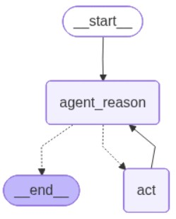

# AGENTE DE SERVICIO

## Descripción

### Contexto del problema
Se requiere acelerar la atención a los clientes mediante un sistema de consulta de documentos internos usando lenguaje natural. Actualmente, la información relevante, como contratos, SLA y políticas, se encuentra dispersa. En consecuencia, se necesita una API que permita realizar preguntas sobre estos documentos y obtener respuestas basadas exclusivamente en la información contenida en ellos.

### Solución
Se desarrolló una API con **FastAPI** que invoca un agente definido en el módulo `app_agent`. Dicho agente fue construido con **LangGraph** y **LangChain**, e incorpora una herramienta de consulta para recuperar los documentos relevantes previamente indexados en una base de datos vectorial implementada con **Chroma**.

Para el diseño del agente se eligió **LangGraph** sobre otras alternativas, como `create_react_agent` de LangChain (`from langchain.agents.react.agent import create_react_agent`). Aunque ambos enfoques están inspirados en la arquitectura **ReAct**, **LangGraph** ofrece un mayor control sobre el flujo de ejecución y facilita la incorporación de nuevas reglas de negocio en futuras versiones.

## Instrucciones
    - cree un ambiente `app_agent`
    - instale dependencias
    - puede levantar el servidor ubicandose en la raiz y ejecutando `python main.py`
    - observe que la base de datos vectorial esta ubicado en: `vectordatabase\chroma_db` luego no necesitas ejucutar el procesos de ingestar los documentos.
    - Si desea insertar documentos ejecute  `python load_documents.py`

### Dependencias
- Python 3.12.3
- Para instalar las dependencias, ejecutar en la terminal:
  `pip install -r requirements.txt`

### Variables de entorno
Se debe crear un archivo `.env` con las variables necesarias para el funcionamiento del agente. En este caso, no se considera una práctica insegura, ya que el archivo no contiene contraseñas ni otros secretos.

- `OLLAMA_MODEL_LLM`: modelo de lenguaje utilizado por el agente. Se emplea `llama3.2` debido a que soporta *tool calling*.
- `CHROMA_PERSIST_DIRECTORY`: directorio donde se almacena la base de datos vectorial en disco.
- `CHROMA_MODEL_EMBEDDINGS`: modelo de embeddings utilizado para la representación vectorial de los textos, en este caso `embeddinggemma`.
- `CHROMA_COLLECTION`: nombre de la colección.
- `CHROMA_K_RETRIEVE`: número de documentos recuperados desde la base de datos vectorial.

### Script de carga
El script para cargar los documentos en la base de datos vectorial Chroma se encuentra en:

`\vectordatabase\ingest\load_documents.py`